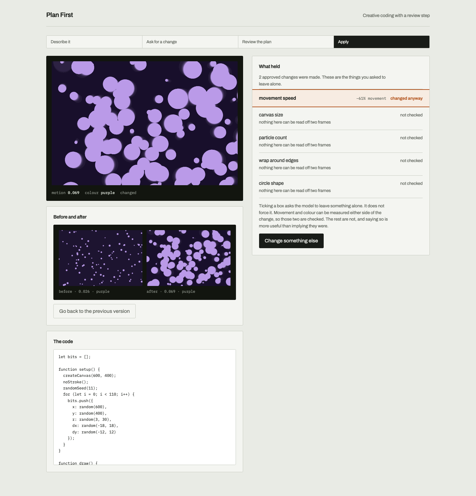

# Plan First

A lightweight Spellburst-inspired prototype exploring a human-in-the-loop
checkpoint before AI-generated creative code is executed.

I built this to investigate one question: if an ambiguous refinement
is shown as a Change / Preserve reading first, and preserved
properties are measured after the code changes, does the artist
actually get the interpretation they approved?

**Demonstration:** [spellburst-prototype.vercel.app](https://spellburst-prototype.vercel.app/?k=demo-96f8d08a2e02ec20)

---

## Motivation

In prompt-driven creative coding, a request such as “make it more
dramatic” can have several valid interpretations. If the model
immediately modifies the code, the artist only discovers the model’s
reading after seeing the result. Participant P5 in the Spellburst
evaluation described this as “a little bit too much magic.”

I wanted to know what happens if that reading is shown first. What if
the artist could inspect and edit the model’s interpretation — move
“speed up the stars” onto Preserve, add “keep the calm movement” —
and only then let the code change? And once that promise is made,
what would it take to check whether it was kept?

---

## What I built

The interaction loop is:

**Prompt → Interpretation → Review → Code change → Verification**

A description becomes a running p5.js sketch. A later refinement does
not touch that sketch. The model returns a plan. The artist edits the
plan. Only Apply rewrites the program. After the new sketch runs, I
compare measurements taken before and after, and label each preserved
item **kept**, **changed anyway**, or **not checked**.

There is no path that applies a refinement without the checkpoint.

A concrete turn:

```
Artist: make it more energetic but keep the colours

CHANGE                         PRESERVE
[x] Increase movement          [x] Dominant colour palette
[x] Raise contrast             [x] Composition

Also: keep the calm drift
```

Unchecked Change items are omitted from the apply request. An item
can move from Change to Preserve. The extra instruction is optional.
Only then does the program change.



---

## Why this is different from Spellburst

[Spellburst](https://arxiv.org/abs/2308.03921) (Angert et al., UIST
2023) supports exploration through branching, semantic prompting, and
comparison of generated creative-code variations. I did not try to
reproduce those capabilities.

I isolated one interaction point: control over the model’s
interpretation before a requested modification is executed, and a
check afterwards on whether a preserved property actually held. The
checkpoint is the obvious next step. Checking the checkpoint is the
part I think is worth building. A preserve instruction that is never
measured is a request, not a promise.

---

## Interaction design

1. The page opens on a running sketch — drifting particles, chosen
   because the motion is large enough to measure — and three example
   refinements. “Make it more dramatic” is meant to reach the plan in
   about fifteen seconds.
2. A refinement is typed, or an example is selected. The interface
   names the step: *working out what you mean*. The sketch does not
   change.
3. Two columns appear, Change and Preserve. Each item has a
   checkbox. An item can be unchecked, or moved from Change to
   Preserve. A free-text field accepts an extra instruction.
4. Apply rewrites the program. The interface names that step too:
   *applying your approved changes*. Cancel drops the plan and leaves
   the sketch as it was.
5. Each preserved item then shows a badge. **Kept** and **changed
   anyway** are reserved for properties I can measure. Everything
   else is **not checked**.

The first screen is never an empty box. The checkpoint does not exist
until a sketch is on screen and a refinement has been asked, so I
seeded both.

---

## Verification

Preserve is an intent, not proof. Writing “keep the star movement”
into a prompt is a polite request. I measure two properties after
Apply, without another model call: movement (mean absolute RGB
difference between two frames, 500 ms apart, downsampled to 64×64,
then divided by the frame’s own contrast) and dominant colour
(nearest named hue bucket, ignoring near-black background).

- If a preserved item names movement, motion, speed, or animation, I
  compare motion. Relative change under 25% is **kept**.
- If it names colour, palette, or a colour word, I compare the
  dominant bucket. Unchanged is **kept**.
- Anything else is **not checked**. I do not report composition,
  geometry, or mood as preserved. I cannot recover them from two
  frames.

I ran that check on 8 September 2026, on `claude-sonnet-5`. Naming a
property in Preserve dropped drift from 25/60 to 6/60. The gap was
not uniform. Four cases never drifted either way — the model was not
going to touch that property, so the checkbox had nothing to do. The
cases that asked for more motion while keeping motion were mixed and
mostly weak. The effect sat in colour, and in “make it calmer,”
which moved the pulse unless movement was named.

Plans were not a stock list: mean overlap of change-property names
across seven requests on the same sketch was 0.04 to 0.17. The six
base sketches measured as expected, 6/6 on motion and 6/6 on colour.

A sentence in the apply prompt did measurable work. It was not a
guarantee. The cases that most needed a guarantee were the ones
where asking was least enough.

The committed figures are at
[`/?eval=1`](https://spellburst-prototype.vercel.app/?eval=1).

---

## Architecture

The path through the system is:

**Frontend → interpretation (`/api/plan`) → reviewed constraints →
code change (`/api/apply`) → sandboxed render → measurement**

| Piece | Choice |
|---|---|
| Shell | Vite, React, TypeScript. State in memory. No accounts, no database. |
| Model | `claude-sonnet-5` for generate, plan, and apply. The API key never reaches the client. |
| Execution | p5.js from a CDN, inside an iframe with `sandbox="allow-scripts"` only. |
| Editor | Monaco, P1. A syntax error is reported in the interface and does not stop the application. |
| Host | Vercel Hobby. One terminal locally: `vercel dev`. |

A few implementation decisions that shape the numbers:

I ask the generator to make movement “plainly visible rather than a
slow drift.” Left alone, the model writes motion too subtle to
measure; on a baseline of 0.001, a 25% relative threshold is noise.
The instruction is a thumb on the scale. It only half works. A night
sky of small stars over a static field still measures around 0.001,
because motion here is a whole-frame average. Below about 0.005 I
report **not checked**. The demo therefore opens on drifting
particles, not on the night-sky example.

I bucket colour by hue, not by RGB distance. Dark artwork makes
nearest-anchor in RGB a coin flip: `#101a2e` is nearly as close to
pure green as to pure blue.

I compare motion after dividing out the frame’s own contrast. A
recolour of drifting particles dropped raw motion from 0.026 to
0.018 — past the 25% threshold — while the drift speed was
character-for-character identical. Without that correction, **changed
anyway** would have been a lie.

The iframe has to stay painted. Hidden or off-screen hosts throttle
`requestAnimationFrame`, and every sketch then captures two identical
frames. I keep the host on screen inside a 1×1 clip.

`claude-sonnet-5` rejects assistant-turn prefill, so I extract JSON
after the fact and validate the plan shape before it reaches the
interface.

The access code `k` is obfuscation. It is visible in the address bar.
Cost control is a spend limit in the Anthropic console, not the query
parameter. See [docs/DEPLOY.md](./docs/DEPLOY.md).

---

## Scope

I intentionally did not recreate Spellburst.

There is no node graph, no branching, no merge, no extract, no
semantic sliders, no collaboration, no accounts, and no persistent
storage. One current sketch and its previous version. A natural-
language refinement always goes through plan, review, apply. I did
not add a “quick apply” shortcut.

Those are non-goals, not unfinished work. I kept the prototype small
so that the two claims stay inspectable.

---

## Limitations

Verification only works for properties I can operationalize.
Movement and colour are two. Composition, geometry, and mood are
not, and those are often what most needs holding still.

Motion has a floor and a ceiling. Below about 0.005 a relative
comparison is noise. Above about 0.17 two frames of a lively sketch
are already near-unrelated, so speeding it up cannot raise the
score. A **kept** on a lively sketch is weaker evidence than the
same verdict on a subtle one.

The generate and plan prompts are biased toward what I can check.
I tell the planner to include at least one movement item and one
colour item. That makes verification demonstrable. It also inflates
how often a confident badge can be shown.

The model can still misunderstand artistic intent. Apply is told
that a kept property wins a conflict, and it often takes that
literally — returning the program unaltered, or leaving a speed
literal untouched while adding jitter on top. A checker that only
read the code would miss that second case. Naming a property does
measurable work. It is not enforcement. I do not reject and retry
when a measured preserve item moves.

An extra checkpoint can interrupt creative flow. I have not
established whether artists prefer this interaction, or whether it
helps. Accuracy is not usefulness.

---

## What I would test next

Does seeing the model’s interpretation before generation improve
perceived control without adding enough friction to disrupt
exploration?

That is the question this prototype is for. The run showed that a
preserve sentence changes what the model does, and that it is not
a guarantee. Whether the checkpoint is worth the pause is not
something those numbers answer.

If I continued the mechanism work, the next step would be
enforcement: reject and retry when a measured preserve item moves.
I would not add branching, sliders, or a larger language around
the plan until I knew whether the pause itself helps.

---

Angert, T., Suzara, M., Han, J., Pondoc, C., and Subramonyam, H.
*Spellburst: A Node-based Interface for Exploratory Creative Coding
with Natural Language Prompts.* UIST 2023.
[arXiv:2308.03921](https://arxiv.org/abs/2308.03921).

```
npm install
cp .env.example .env
vercel dev
```

`http://localhost:3000/?k=<DEMO_KEY>`. `?dev=1` runs the module
checks in [docs/BUILD.md](./docs/BUILD.md). `?eval=1` shows the
committed figures. `?seed=night-sky` loads an alternate frozen sketch.

Supporting notes are in [docs/](./docs/): the build order, deploy
checklist, agent brief, and [how AI was used](./docs/AI-USAGE.md).
